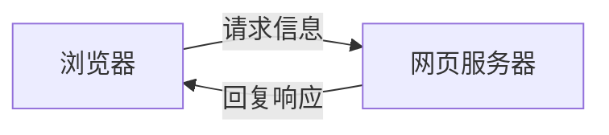

## MIME标准

MIME：multipurpose internet mail extensions

一种标准，有电子邮件格式扩展而来，通常的格式为  `type/subtype`，常见的MIME类型为：
```python
text/plain
text/html
application/json
application/xml
image/jpeg
audio/mpeg  # mp3
```

## 请求信息
1. 首行 , 如：GET  /index.html  HTTP/1.1
2. User-Agent: 用户程序，代理用户操作，因此记录用户信息，如：
   浏览器，操作系统信息等
3. Accept：text/html, image/png, application/json 等MIME类型

其他待续